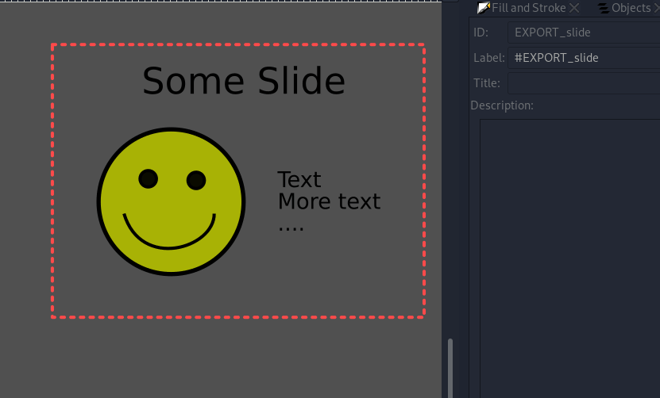

# Inkscape Canvas cli

Use **one** svg file as canvas, export individual sections as PDF, by defining squared and setting labels.
Exported PDF's or SVG's are chopped exactly to defined square size.

## Usage

The script uses an Inkscape installation of you system, it requires version `1.1.2` or newer.
You should always define either `INKSCAPE_EXE` in shell env or `-exe` as parameter, provide the path to your Inkscape installation.
Define the SVG input file as `-i`. Per default tags are filtered by prefix `EXPORT_`, overwrite this with `-p`.
Export all files with a prefix by `-a`, provide output directory by `-o`. Use `-v` for verbose output.

So to *export all prefixed files* e.g.: `inkscapecli.py -a -i example.svg -o exports/ -exe <inkscape-path>`

Or to export a specific tag e.g.: `inkscapecli.py -x -p "" -i example.svg -t <tag-name> -o exports/ -exe <inkscape-path> -v`

> See all options: `inkscapecli.py --help`